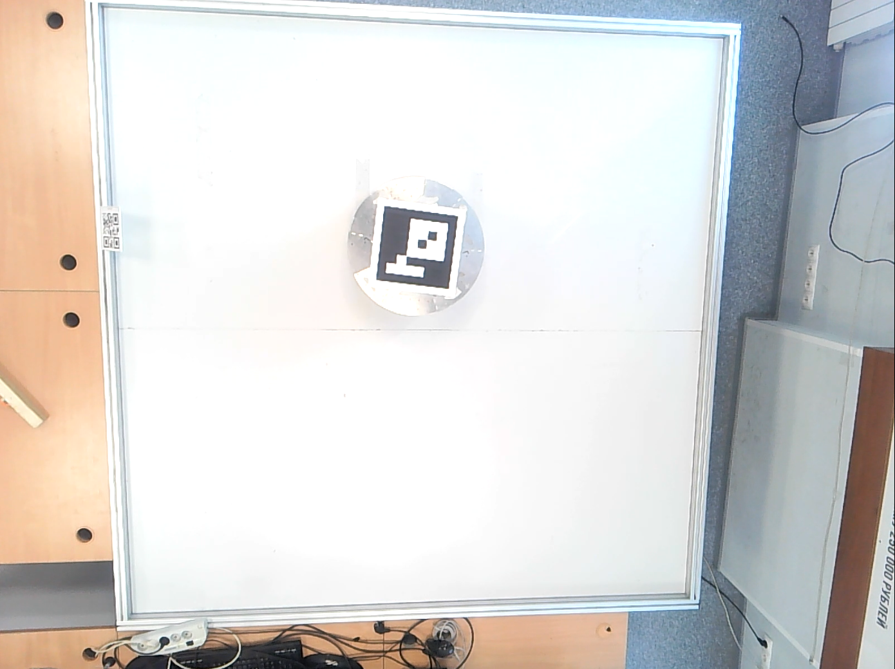
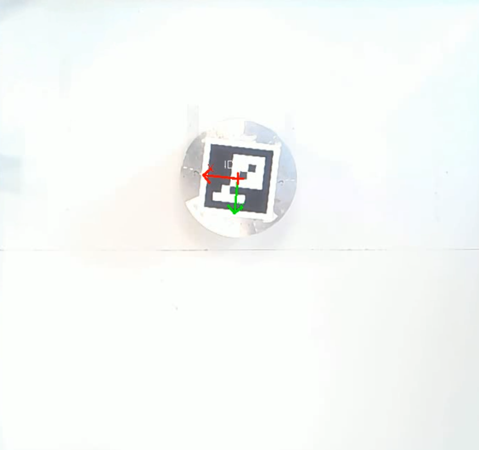
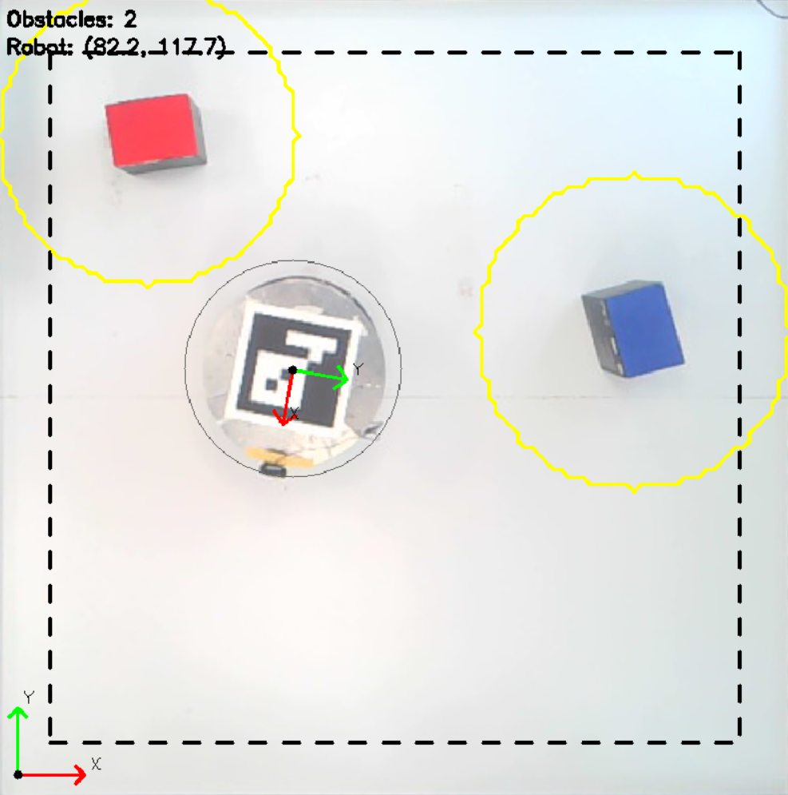

# Обход препятствий мобильным роботом
## Задание
Необходимо обеспечить управление мобильным роботом: над полем, по которому движется робот, установлена камера, транслирующая видео. Пользователем в реальном времени на видеопотоке задается конечная точка, в которую должен приехать робот; определяя препятствия и объезжая их, робот должен прибыть в конечную точку. Необходимо отобразить координаты робота во время перемещения, а также длину пройденного им пути.
## Реализация
### Обработка видеопотока
Первым этапом будет работа с видеопотоком. Необходимо:

- Провести предобработку видеопотока, выровнять изображение с камеры
- Иденцифицировать положение робота
- Определить препятствия на поле
- Реализовать возможность задания координат конечной точки по видеопотоку

Так как камера установлена не ровно, необходимо выровнять кадры таким образом, чтобы соблюсти реальные пропорции. Так как поле и камера статичны, а размеры поля известны - углы поля просто указываются вручную и записываются в отдельном файле для дальнейшего выравнивания кадров видеопотока.

Для определения положения робота в пространстве и определения его локальной системы координат относительно глобальной системы координат (системы координат поля) будет использоваться AruCo-метка на поверхности робота. По aruco-метке выбираются оси для связной системы координат робота.

Планируется выделять препятствия с помощью выделения контуров объектов.

### Алгоритм движения

### Взаимодействие с роботом

### Результаты работы

## Заключение

