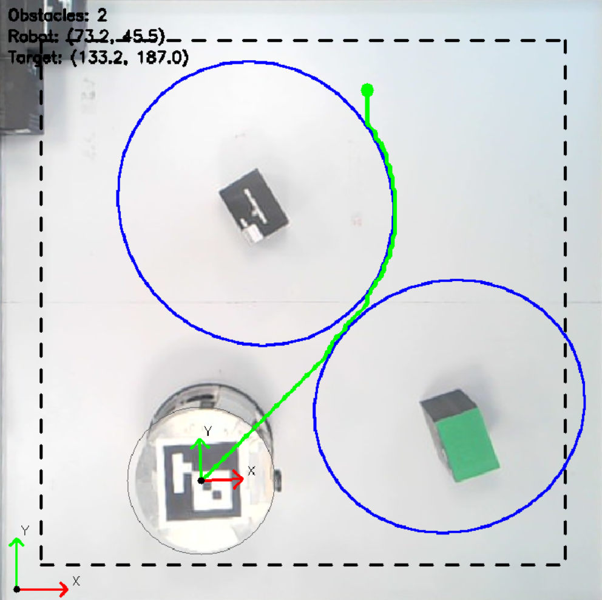
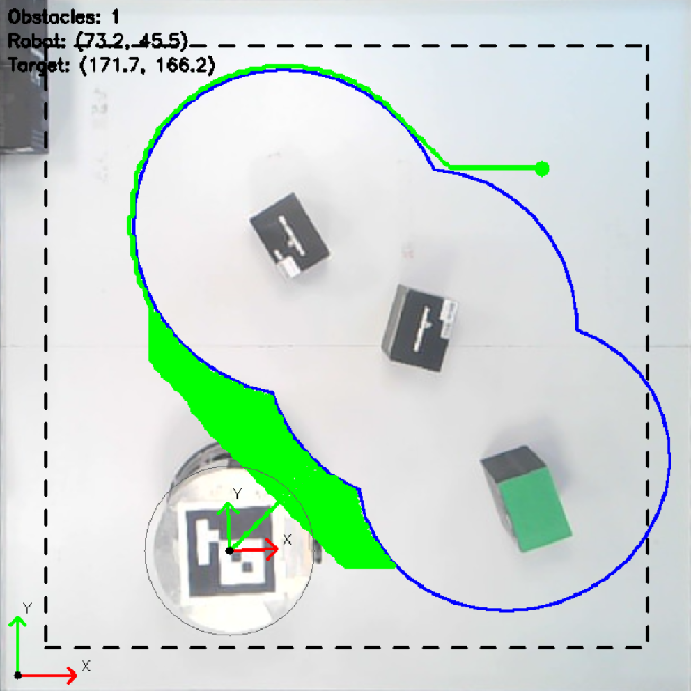
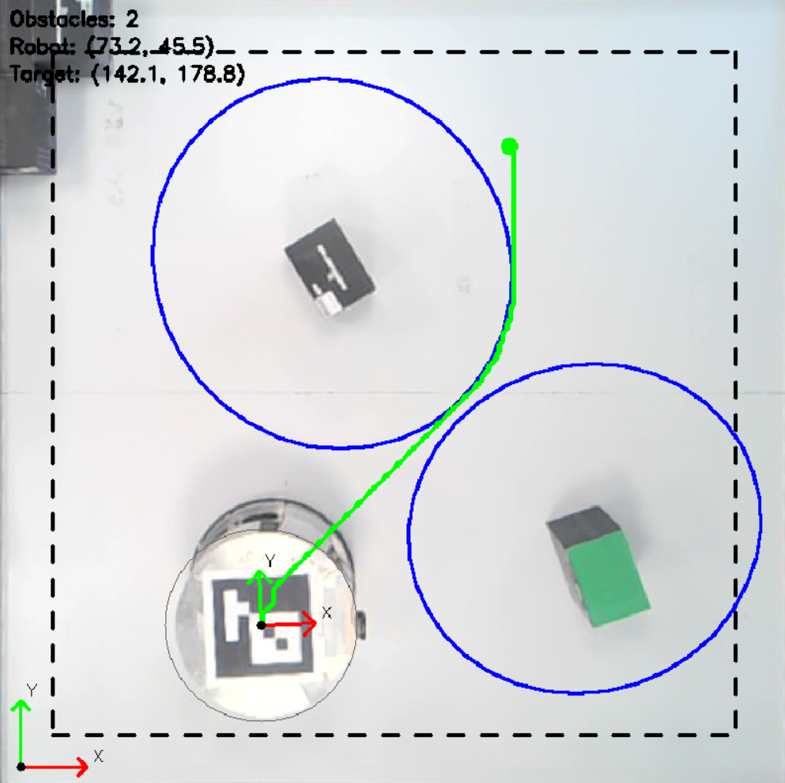
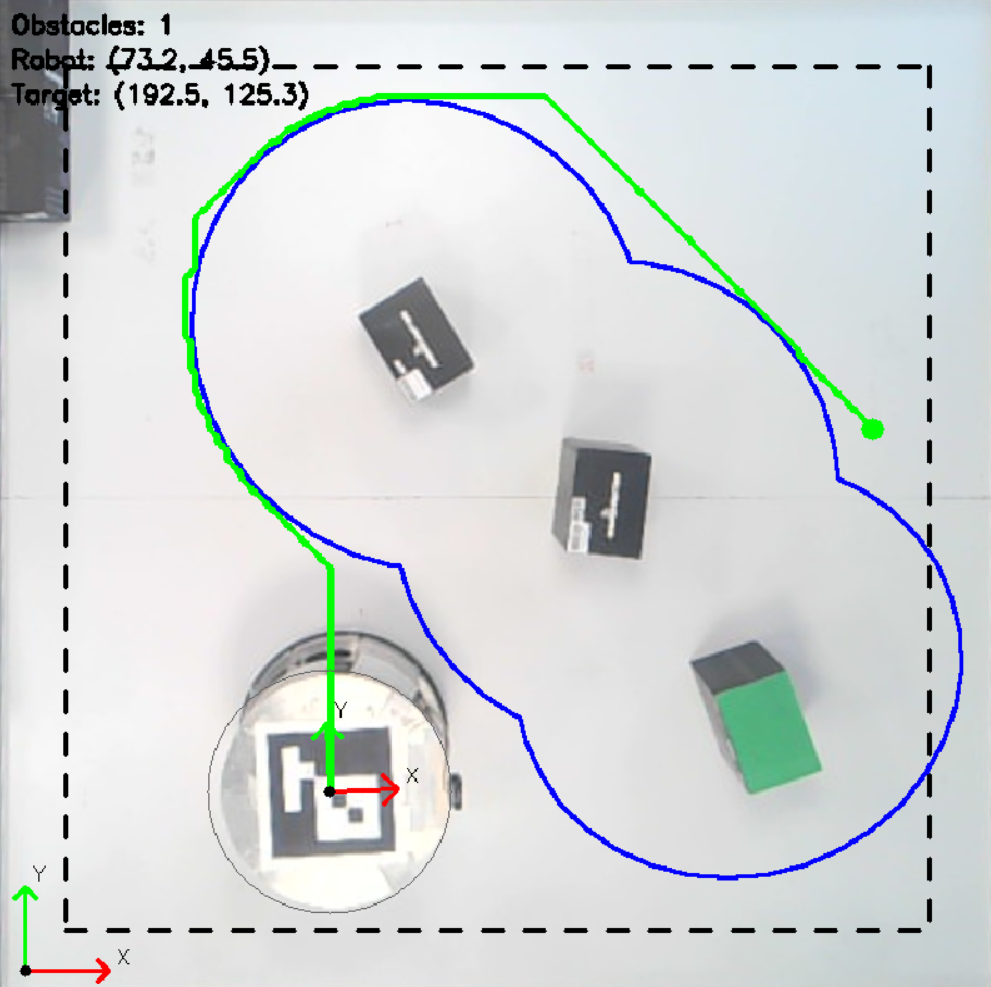

# Обход препятствий мобильным роботом
## Задание
Необходимо обеспечить управление мобильным роботом: над полем, по которому движется робот, установлена камера, транслирующая видео. Пользователем в реальном времени на видеопотоке задается конечная точка, в которую должен приехать робот; определяя препятствия и объезжая их, робот должен прибыть в конечную точку. Необходимо отобразить координаты робота во время перемещения, а также длину пройденного им пути.

## Обработка видеопотока

  
  

  

В результате на видео выводятся:
- контура препятствий с запасом по расстоянию;
- контур робота;
- контур по краю кадра;
- количество препятствий;
- координаты робота;
- координаты заданной точки.

## Алгоритм и условия движения

  

  
  

  
  

## Заключение

